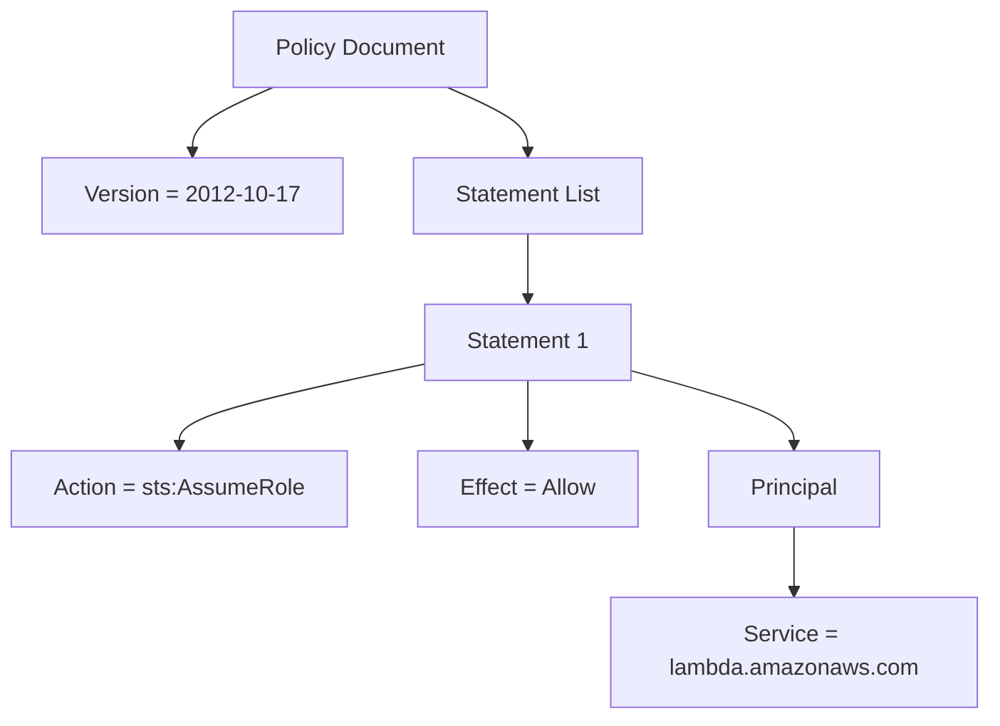
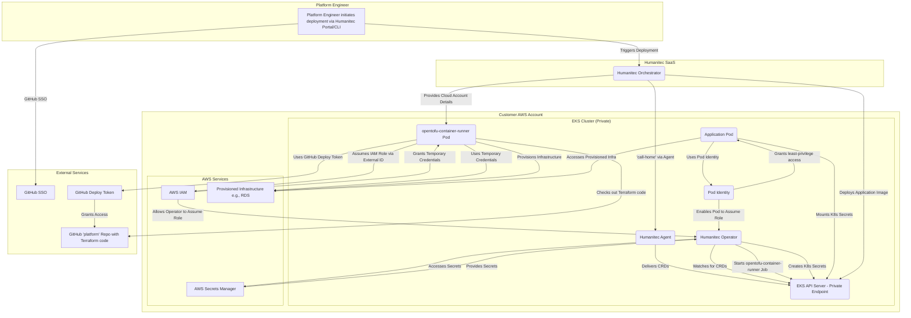

# Were to start with recommended security settings and controls for Startup & AWS Org

- [AWS Startup Security Baseline](https://docs.aws.amazon.com/prescriptive-guidance/latest/aws-startup-security-baseline/welcome.html)
- Above but with terraform:
  - [How to implement baseline AWS security with Terraform p1](https://blog.avangards.io/how-to-implement-aws-ssb-controls-in-terraform-part-1)
  - [How to implement baseline AWS security with Terraform p2](https://blog.avangards.io/how-to-implement-aws-ssb-controls-in-terraform-part-2)
  - [How to implement baseline AWS security with Terraform p3](https://blog.avangards.io/how-to-implement-aws-ssb-controls-in-terraform-part-3)
   - [How to implement baseline AWS security with Terraform p4](https://blog.avangards.io/how-to-implement-aws-ssb-controls-in-terraform-part-4)
- Individual detective services
### AWS Guard Duty


Guard Duty is an intelligent threat-detection service that provides customers with a way to continuously monitor and protect their AWS accounts and workloads. GuardDuty identifies suspected attackers through integrated threat intelligence feeds and uses machine learning (ML) to detect anomalies in account and workload activity. It monitors for activity such as unusual API calls or unauthorized deployments that indicate that a customer’s accounts might have been compromised. It also monitors direct threats, like compromised instances or reconnaissance by attackers.
Since it is managed service as soon as you activate it, AWS provision all needed permissions to get access & inject CloudTrail, VPC Flow, DNS logs to Guard Duty and analyze them for anomalies, known threat patterns, malicious IP address, known malicious DNS request, known Crypto Mainin addresses,  etc. Admin has to implicitly enable additonal services - like EKS Log monitoring, Lambda, Malware EC2 and container image scans.


To learn more, see Amazon GuardDuty
There is an [option to manage GuarDuty with AWS Organizations](https://docs.aws.amazon.com/guardduty/latest/ug/guardduty_organizations.html) through delegated GuardDuty Admin AWS account - add members, enable Protection plans, suspend/disable GD in indovidual AWS accounts etc.
Guard Duty has to be enabled on per region basis. Auto-Enable for new Accounts is configurable.


#### Confusion with Terraform and Guard Duty
In mid 2023 [Guard Duty API was changed by Amazon](https://docs.aws.amazon.com/guardduty/latest/ug/guardduty-feature-object-api-changes-march2023.html) and pre-2023 datasources were replaced with features. Hence lot of confusion between old information/terraform resources and the new ones. 
Moreover there are so-called *Advanced Terraform Resources* like 
```
aws_guardduty_organization_configuration
```
which causes *"...Terraform to automatically assume management of the GuardDuty Organization Configuration without import and perform no actions on removal from the Terraform configuration."*
sigh

You have been warned.
Known side effects of using terraform resources to manage Guard Duty:
One  can  use the aws_guardduty_organization_admin_account resource to set the delegated administrator. However it causes following in the Audit account:

After this resource is created, GuardDuty will be enabled with both the foundational data sources and all protection plans enabled.
When the resource is deleted, GuardDuty remains enabled.

These side effects are not desirable since we would ideally want full control over the lifecycle and configuration of GuardDuty in Terraform. To address this issue, we will preemptively enable GuardDuty in the Audit account using the aws_guardduty_detector resource. We will also manage the protection plans using the aws_guardduty_detector_feature resource in subsequent steps after we define the org-wide settings.
__________

### AWS Security Hub


Security Hub gives you a single pane of glass view of your high-priority security alerts and compliance status across AWS accounts. It provides you a single place that aggregates, organizes, and prioritizes your security alerts, or findings, from multiple AWS services, such as Amazon GuardDuty, Amazon Inspector, and Amazon Macie, in addition to AWS Partner solutions.

To learn more, see AWS Security Hub


________
### AWS Inspector


Inspector automatically discovers workloads, such as Amazon EC2 instances, containers, and Lambda functions, and scans them for software vulnerabilities and unintended network exposure.


Amazon Inspector is an automated vulnerability management service that continually scans workloads for software vulnerabilities and unintended network exposure.

To learn more, see Inspector

______

- Guard Duty Intro & Udemy video
### Guard Duty Terraform resources
- aws_guradduty_detector
- aws_guardduty_detector_feature
- aws_guardduty_publishing_destination
- aws_guardduty_threatintelset 
- aws_guardduty_organization_configuration
- aws_guardduty_organization_configuration_feature
- aws_guardduty_member
- aws_guardduty_invite_accepter 
- aws_guardduty_ipset
___________________
- [Guard Duty Terraform code creation youtube video](https://www.youtube.com/watch?v=pKuDpeLFxtI&t=939s)
- [How to manage AWS Guard Duty with Terraform](https://blog.avangards.io/how-to-manage-amazon-guardduty-in-aws-organizations-using-terraform)
_________________  

* 
* | + | - string
        * | + | - string
                * | + | - string




```mermaid
  info
```



