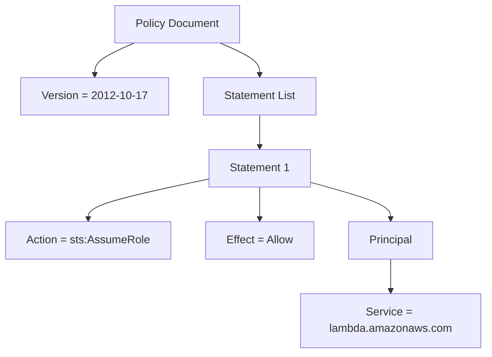

# Were to start with recommended security settings and controls for Startup & AWS Org

- [AWS Startup Security Baseline](https://docs.aws.amazon.com/prescriptive-guidance/latest/aws-startup-security-baseline/welcome.html)
- Above but with terraform:
  - [How to implement baseline AWS security with Terraform p1](https://blog.avangards.io/how-to-implement-aws-ssb-controls-in-terraform-part-1)
  - [How to implement baseline AWS security with Terraform p2](https://blog.avangards.io/how-to-implement-aws-ssb-controls-in-terraform-part-2)
  - [How to implement baseline AWS security with Terraform p3](https://blog.avangards.io/how-to-implement-aws-ssb-controls-in-terraform-part-3)
   - [How to implement baseline AWS security with Terraform p4](https://blog.avangards.io/how-to-implement-aws-ssb-controls-in-terraform-part-4)
- Individual detective services
### AWS Guard Duty
Amazon GuardDuty 

is an intelligent threat-detection service that provides customers with a way to continuously monitor and protect their AWS accounts and workloads. GuardDuty identifies suspected attackers through integrated threat intelligence feeds and uses machine learning (ML) to detect anomalies in account and workload activity. It monitors for activity such as unusual API calls or unauthorized deployments that indicate that a customer’s accounts might have been compromised. It also monitors direct threats, like compromised instances or reconnaissance by attackers.

To learn more, see Amazon GuardDuty


### AWS Security Hub
 gives you a single pane of glass view of your high-priority security alerts and compliance status across AWS accounts. It provides you a single place that aggregates, organizes, and prioritizes your security alerts, or findings, from multiple AWS services, such as Amazon GuardDuty, Amazon Inspector, and Amazon Macie, in addition to AWS Partner solutions.

To learn more, see AWS Security Hub


### AWS Inspector
automatically discovers workloads, such as Amazon EC2 instances, containers, and Lambda functions, and scans them for software vulnerabilities and unintended network exposure.

Amazon Inspector is an automated vulnerability management service that continually scans workloads for software vulnerabilities and unintended network exposure.

To learn more, see Inspector

______
- Guard Duty Intro & Udemy video
### Guard Duty Terraform resources
- aws_guradduty_detector
- aws_guardduty_detector_feature
- aws_guardduty_publishing_destination
- aws_guardduty_threatintelset 
- aws_guardduty_organization_configuration
- aws_guardduty_organization_configuration_feature
- aws_guardduty_member
- aws_guardduty_invite_accepter 
- aws_guardduty_ipset
___________________
- [Guard Duty Terraform code creation youtube video](https://www.youtube.com/watch?v=pKuDpeLFxtI&t=939s)
- [How to manage AWS Guard Duty with Terraform](https://blog.avangards.io/how-to-manage-amazon-guardduty-in-aws-organizations-using-terraform)
_________________  

* 
* | + | - string
        * | + | - string
                * | + | - string




```mermaid
  info
```


